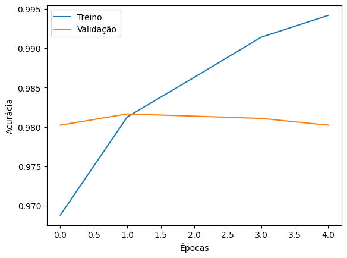

# 🐱🐶 Transfer Learning - Cats vs Dogs

Projeto do Bootcamp **BairesDev Machine Learning (DIO)** para aplicar Transfer Learning em Deep Learning com Python.

## 📖 Descrição
Este projeto demonstra como utilizar um modelo pré-treinado (MobileNetV2) para classificar imagens entre duas classes: **gatos e cachorros**.

O dataset usado foi o **Cats vs Dogs** disponível no [TensorFlow Datasets](https://www.tensorflow.org/datasets/catalog/cats_vs_dogs).

## 🎯 Objetivos
- Aplicar Transfer Learning em um problema de classificação de imagens.
- Treinar um modelo binário em dataset real.
- Documentar processo e resultados no GitHub.

## 📂 Estrutura do Repositório
```
├── transfer_learning.ipynb # Notebook com código
├── README.md # Documentação do projeto
└── /images # Prints de gráficos/resultados (opcional)
```

## 🚀 Como Executar
1. Abrir o notebook no Google Colab.
2. Instalar dependências (TensorFlow, TensorFlow Datasets).
3. Executar todas as células.

## 📊 Resultados
- Modelo: **MobileNetV2 (pré-treinado no ImageNet)**
- Épocas: 5
- Acurácia no teste: **xx%**
- Gráfico de acurácia:



## 🔗 Dataset
- Cats vs Dogs: [link oficial](https://www.tensorflow.org/datasets/catalog/cats_vs_dogs)

## 👩‍💻 Autora
Projeto desenvolvido por **[Seu Nome]**.
